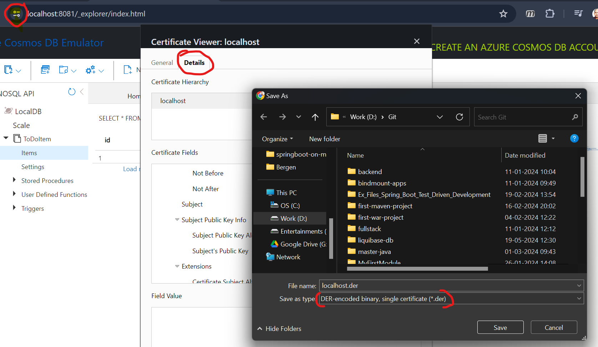

# SpringBoot Azure Sample application. 

This Repo contains sample applications build using the Azure services with their dependent libraries like Azure CosmosDB(NoSQL).

## Azure Cosmos DB.

### Setup
   1. Download the Azure Cosmos DB emulator.
   2. Run the installer on your local machine with administrative privileges.
   3. Import TLS/SSL certificate to local Java installation to run your application
   4. Create a desired container in https://localhost:8081/_explorer/index.html

#### Certification setup
1. Export the Cosmos Certification and save to your local

2. Run below command in the cmd prompt as Administrator
3. `keytool -importcert -file localhost.der  -alias cosmos -keystore "%JAVA_HOME%\lib\security\cacerts" -storepass changeit`